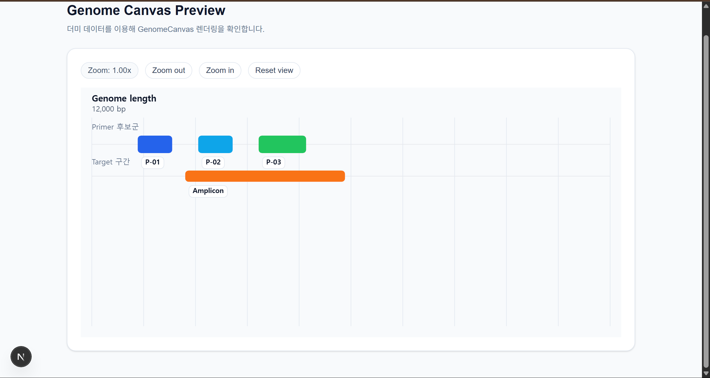

# 🧬 PrimerFlow

> **High-Performance PCR Primer Design & Visualization Platform**

## 프로젝트 개요
**PrimerFlow**는 생명과학 연구원들이 PCR 프라이머를 설계할 때 겪는 비효율을 해결하기 위한 웹 솔루션입니다.


## PrimerFlow 주요 기능 명세
- DNA 템플릿 시퀀스를 넣고 PCR 프라이머 후보를 생성합니다.
- 결과 화면에서 후보 위치를 시각적으로 확인할 수 있습니다.
- 확대/축소로 원하는 구간을 자세히 볼 수 있습니다.

### Step 1. Input Sequence

입력 방법:
- 직접 입력
- `Upload as file`로 파일 업로드
- `Paste` 버튼 또는 `Ctrl+V`로 붙여넣기
- `Clean`으로 전체 지우기

입력 규칙:
- `A`, `T`, `G`, `C`만 사용 가능합니다.
- 공백, 줄바꿈, FASTA 헤더(`>`)는 자동 정리됩니다.
- 다른 문자가 포함되면 제거 여부를 묻는 안내창이 뜰 수 있습니다.

중요:
- 유효한 염기서열이 없으면 다음 단계/생성이 막힙니다.
- 아주 긴 서열은 안정성을 위해 미리보기 형태로 보여줄 수 있습니다. 생성에는 전체 데이터가 사용됩니다.

### Step 2. Primer Properties
- 프라이머 조건(예: GC, Tm, 농도)을 설정하는 단계입니다.

### Step 3. Binding Location
- 결합 위치 관련 옵션을 보는 단계입니다.
- `Restriction Enzymes`는 Enter 또는 쉼표(`,`)로 태그처럼 추가할 수 있습니다.
- 잘못 넣은 효소명은 태그를 눌러 제거할 수 있습니다.

### Step 4. Specificity & Preview
- 특이성 관련 옵션과 미리보기 캔버스를 확인합니다.

캔버스에서 가능한 조작은 아래와 같습니다.
- `+` / `-`: 확대/축소
- `Reset view`: 초기 시야로 복귀
- 마우스 드래그: 좌우/상하 이동
- 마우스 휠: 포인터 위치 기준 확대/축소

`Generate Primers`를 누르면 결과 탭이 열리고, 가능한 조작은 다음과 같습니다.
- 프라이머 후보 구간을 캔버스에서 확인
- Zoom/Reset으로 원하는 범위 탐색
- `Close` 버튼으로 결과 화면 종료


## 프로젝트 구조

```text
frontend/
├─ app/
│  ├─ page.tsx                  # 4-step wizard 메인 화면
│  ├─ result/
│  │  ├─ page.tsx               # 결과 라우트(클라이언트 동적 import)
│  │  └─ ResultClientPage.tsx   # resultKey 기반 결과 복원/표시
│  ├─ layout.tsx
│  └─ providers.tsx             # QueryClientProvider
├─ components/
│  ├─ canvas/GenomeCanvas.tsx   # 공용 캔버스 인터랙션(패닝/휠 줌)
│  ├─ steps/                    # Step1~Step4 UI
│  ├─ ui/                       # 헤더/푸터/네비게이션
│  └─ PrimerResultModal.tsx
├─ src/
│  ├─ lib/                      # 알고리즘, API 클라이언트, 파서, storage
│  ├─ services/analysisService.ts
│  └─ types/
├─ store/useViewStore.ts
├─ hooks/
├─ tests/
backend/
├─ .github/               # GitHub 워크플로우 설정
├─ .husky/                
├─ app/                   # FastAPI 애플리케이션 코드
│  ├─ main.py
│  ├─ api/
│  │  └─ v1/
│  │     └─ endpoints/
│  │        ├─ design.py
│  │        └─ health.py
│  ├─ algorithms/
│  └─ schemas/
├─ database/              # DB 파일 및 원천 데이터
├─ scripts/               # DB 구축/점검 스크립트
├─ tests/                 # pytest 테스트 코드
├─ main.py
├─ requirements.txt
├─ README.md
└─ .gitignore
prompts/                  # 프롬프트 문서
spec/                     # 스펙 문서
strategy/                 # 협업 문서
README.md                 # 통합 README
```


## 개발 환경 설정
### Frontend
### 0. 요구 사항

- Node.js 20.x 이상
- npm
- 로컬 백엔드 서버(`http://127.0.0.1:8000`)

### 1. 설치

```bash
# 1) 의존성 설치
npm ci
```

### 2. 개발 서버 실행

```bash
npm run dev
```

### 스크립트 (참고)

```bash
npm run dev     # 개발 서버
npm run build   # 프로덕션 빌드
npm run start   # 프로덕션 서버 실행
npm run lint    # eslint .
npm test        # vitest run
```

---
### Backend
### 1. 가상환경 생성 및 활성화

 - Windows
     > `pysam` 라이브러리의 원활한 지원을 위해 WSL 사용을 권장합니다.
     ```bash
     # WSL(Ubuntu 등)으로 접속한 뒤 아래 macOS/Linux 명령을 그대로 실행하세요.
     ```

- macOS / Linux
    ```bash
    # (Ubuntu/WSL) venv 모듈이 없으면 먼저 설치
    sudo apt update
    sudo apt install -y python3-venv
    python3 -m venv .venv
    source .venv/bin/activate
    ```

### 2. 의존성 설치

```powershell
pip install -r requirements.txt
```

### 3. 개발 서버 실행

```powershell
uvicorn app.main:app --reload
```
- 기본 엔드포인트: http://localhost:8000/
- OpenAPI 문서: http://localhost:8000/docs
- ReDoc 문서: http://localhost:8000/redoc


## 기술 스택
### Frontend
- **Framework**: Next.js
- **Language**: TypeScript
- **UI**: React, Tailwind CSS, lucide-react
- **State**: Zustand
- **Data**: Axios, TanStack Query
- **Test**: Vitest

### Backend
- **Framework** : FastAPI
- **Language** : Python
- **Validation** : Pydantic
- **API docs**: Swagger (OpenAPI)
- **Server**: Uvicorn
- **Database**: SQLite
- **Bioinformatics**: pysam

### Quality & Testing
- **Linter/Formatter**: Ruff
- **Type Checking**: Pyright
- **Test**: pytest

### Collaboration
- **Commit Rule**: commitlint
- **Git Hooks**: Husky

### AI Tools
- OpenAI Codex, Google Gemini, GitHub Copilot

## 주간 진행 상황

### Week 1 (25.12.22 - 12.28)
### Frontend
- 작업 내역:
  - 기술스택 선정
    - Next.js: 메인 페이지(`app/page.tsx`)와 전역 레이아웃을 구성, 정적 리소스 관리 및 헤드 설정
    - TypeScript: 컴포넌트, 전역 스토어, 유틸 타입을 명시
    - Canvas API: 캔버스 컨텍스트 직접 처리, 대용량 서열 렌더링, 줌/패닝 변환, 텍스트/바 도형 그리기
    - Zustand: 캔버스 뷰 상태, 리셋/업데이트 액션의 전역 관리
    - Vercel: Next.js 앱 배포
  - 프로젝트 기본 아키텍처 및 스켈레톤 코드 구성
- AI 활용:
  - Gemini로 상세 프롬프트 작성
  - Codex로 프로젝트 아키텍처 및 스켈레톤 코드 작성
- 다음 주 계획:
  - `page.tsx`, `layout.tsx` 구현, 목 데이터 출력 확인
### Backend
- **작업 내역** : [1주차 Commit](https://github.com/Seq-Lab/PrimerFlow-BE/commit/9b9bf9882e8c376c14fa8daf3cecbde0a3b4d911)
    - 백엔드 기본 구조 세팅
    - [협업 가이드 추가](https://github.com/Seq-Lab/PrimerFlow-BE/commit/9c5e5de6a69456014aa58f39036ce55c5d420dcc)


### Week 2 (25.12.29 - 26.1.4)
### Frontend
- 작업 내역:
  - 더미 데이터로 페이지 연결
  - 뷰 상태(Zustand)와 줌/패닝 동작 정돈
- AI 활용:
  - Codex로 `layout.tsx`, `page.tsx` 세부 구현 및 디버깅
- 완료 기능:
  - 목 데이터 출력 상태 확인
- 테스트 결과:
  - 
- 다음 주 계획:
  - 스펙 기반 초기 입력 폼과 검증 로직 착수
### Backend
- **작업 내역** : [2주차 Commit](https://github.com/Seq-Lab/PrimerFlow-BE/commit/4d11e13ac10cfcb9f8f09c41035bbc8fe3148adf)
    - 명세서 작성 및 프롬프트 추가
    - 협업 편의성을 위해 commitlint 추가
- **AI 활용**
    - main 브랜치 PR 차단 워크플로우 추가 : `.github/workflows/check-main-pr.yml` 생성
     - Spec문서 작성 : GPT와 Gemini에 동일 프롬프트를 입력하고 결과를 통합해 정리


### Week 3 (26.1.5 - 1.11)
### Frontend
- 작업 내역:
  - PCR 프라이머 디자인 스펙 작성(1-based 규칙, IUPAC 제한, 성능 목표 포함)
  - 메인 UI 디자인 결정 및 다크 톤 4단계 스텝 플로우로 리워크
  - Genome 타입 분리
- AI 활용:
  - Stitch, Figma에 동일 프롬프트를 넣어 디자인 비교 후 채택
- 완료 기능:
  - 단계별 UI 구현 완료
  - 1단계: 시퀀스 입력(FASTA/raw textarea)
  - 2단계: Primer Properties (GC% 범위, 최대 Tm 차이, GC Clamp, Poly-X 제한, 농도/염 조건)
  - 3단계: Binding Location (검색 범위, Exon junction 옵션, Intron 포함/범위, Restriction enzyme 입력)
  - 4단계: 결과물 출력
- 테스트 결과:
  - 1단계: 
  - 2단계: 
  - 3단계: 
  - 4단계: 
- 다음 주 계획:
  - 실제 데이터 연동, GenomeCanvas 미리보기 및 컨트롤 마무리
### Backend
- **작업 내역** : [3주차 Commit](https://github.com/Seq-Lab/PrimerFlow-BE/commit/7289717ca93a8d654a0fe5c4d7c3a685a06dc616)
    - `schemas/` 폴더 내 Pydantic 모델 정의
    - `/design` 엔드포인트 정의 (구현 미완료)
    - 알고리즘 명세 및 아키텍처 다이어그램 문서 추가
- **AI 활용**
    - Copilot 리뷰 한국어 지침 추가 : `.github/copilot-instructions.md` 생성

### Week 4 (26.1.12 - 1.18)
### Frontend
- 작업 내역:
  - 백엔드 모킹 서비스 구현 및 결과 시각화
  - Step 1 시퀀스 입력 편의성 개선
  - 컴포넌트 아키텍처 개선 및 UI 업데이트
- AI 활용:
  - Codex로 캔버스 표시 모달 구현
  - Paste 등 버튼 기능 구현
- 완료 기능:
  - 목 데이터를 모달로 표시
  - Step 1에서 DNA 서열 입력 시 FASTA 업로드, 클립보드 붙여넣기 지원
- 테스트 결과:
  - 목 데이터 표시 확인: 
- 다음 주 계획:
  - 완성된 백엔드와 연동하여 결과 표시 및 디버깅
### Backend
- **작업 내역** : [4주차 Commit](https://github.com/Seq-Lab/PrimerFlow-BE/commit/0f66dc4ef55129c4381c34d9d081c29c09b1e388)
    - `PrimerDesigner.py` 구현: 핵심 PCR 프라이머 설계 로직 첫 번째 버전 추가
    - 블랙박스 테스트 케이스 설계(EP, BVA, CE) 및 파일 추가
    - 테스트 케이스 시나리오 초안 완성 (지속적 보완 예정)
- **AI 활용**
    - 블랙박스 테스트 케이스 설계 : `docs/prompts/4주차/test_design_prompt.md` 참고

### Week 5 (26.1.19 - 1.25)
- 작업 내역:
  - 프론트엔드-백엔드 간 API 통신 규격(Spec) 정의 및 연동 구현
- AI 활용:
  - Codex로 Nested Object를 UI 전용 상태(Flat Object)로 변환하는 어댑터 패턴 코드 생성
- 완료 기능:
  - 프라이머 설계 요청 프로세스 구현: 입력값 -> 어댑터 -> API 호출
  - 결과 모달 데이터 바인딩: Mock 데이터 기반 캔버스/리스트 렌더링
- 다음 주 계획:
  - 사용자 입력 DNA 서열 전처리(Sanitization) 및 유효성 검증 로직 구현

### Week 6 (26.1.26 - 2.1)
- 작업 내역:
  - 대용량 데이터(10,000bp+) 렌더링 성능 최적화를 위한 뷰포트 탐색 로직 개선
  - 캔버스 스크롤 시 배경이 함께 밀리는 Jittering 버그 수정 및 레이어 고정 처리
- AI 활용:
  - Codex로 binary search 알고리즘 로직 검증 및 최적화
  - Gemini로 문제 상황 설명 프롬프트 작성, Codex로 수정 적용
- 완료 기능:
  - Binary Search 렌더링 최적화: `O(N)` -> `O(log N)` 개선으로 고BP 구간 프레임 드랍 완화
  - Canvas 배경 고정 렌더링 처리
- 다음 주 계획:
  - 입력 데이터 validator 구현

### Week 7 (26.2.2 - 2.8)
- 작업 내역:
  - Step1 시퀀스 입력 정규화 및 검증 UX 개선
  - ATGC 대소문자 처리 및 비정상 문자(N, 숫자, 특수문자) 필터링 로직 정립
  - 붙여넣기/파일 업로드 시 사용자 동의 UX 일관성 확보
- AI 활용:
  - 4단계 프롬프트(Phase 1~4) 기반 단계별 로직 고도화 및 트러블슈팅
  - Next.js Turbopack import 경로 이슈 분석 및 해결
  - 대량 문자열 붙여넣기 시 과도한 삭제 문제에 대한 sanitize 방식 개선안 적용
- 완료 기능:
  - 실시간 정규화: 입력 즉시 대문자 ATGC 변환 및 실시간 필터링
  - 예외 처리: Upload/Paste/Ctrl+V 시 비정상 문자 감지 시 확인 후 제거
  - chunk 단위 sanitize 전환으로 성능 개선 및 중복 검증 제거
- 다음 주 계획:
  - 목 데이터 제거 및 배포 백엔드 연결


### Week 8 (26.2.9 - 2.15)
### Frontend
- 작업 내역:
  - Mock Data 응답 제거 및 실서버 응답 구조 기준으로 프론트 로직 전환
  - 요청 파라미터를 백엔드 스펙에 맞춰 정리, 요청/응답 매핑 점검
  - API 호출 실패 상황(네트워크/서버 오류) 메시지 및 상태 처리 보강
  - 디자인/UI 리뉴얼
    - Poppins 폰트 도입
    - 헤더 리뉴얼(`PF` 텍스트 -> 로고 이미지, `Primer Designer by SeqLab`)
    - Step 1 카드 헤더 패딩 조정(`py-4 -> py-2`)
    - Step 4 불필요 요소(`Quality notes`) 제거
    - 불필요 빈 파일(`tailwind.config.ts`) 삭제
  - 코드 품질 자동 검증 PR 반영
    - GitHub Actions PR 시 Lint/Test/Build 자동 실행
    - Vitest 도입 및 `npm test` 스크립트 추가
    - 린트 스크립트 `eslint .`로 확장
    - `visibleRange` 기초 테스트 작성
- AI 활용:
  - Codex로 API 클라이언트 경로(`/api/design`)와 서비스 레이어 매핑 검증
  - 응답 데이터 변환 과정의 타입 안정성 점검 및 개선
- 완료 기능:
  - 배포 백엔드 API 연동 완료
  - 백엔드 응답을 Result Modal/Canvas 렌더링 가능한 형태로 변환해 표시
  - Mock 의존 제거, 실데이터 기반으로 전환
  - PR 품질 게이트(Lint/Test/Build) 자동 검증 체계 구축
  - `visibleRange` 핵심 로직 테스트 기반 확보
### Backend
- **작업 내역** : [8주차 Commit](https://github.com/Seq-Lab/PrimerFlow-BE/commit/235451f6e47103919f97dce966bac7b985a1955e)
    - 기존 루트(`api/, schemas/, algorithms/`)를 `app/` 하위로 이동하고 import 경로를 `app.*`로 정리
    - GitHub Actions CI 파이프라인 및 Ruff/Pyright 설정(`pyproject.toml`) 추가
    - `/health` 엔드포인트에 대한 기본 테스트 추가 및 실행 가이드 업데이트
- **AI 활용**
    - CI 파이프라인 구축 도움 : `docs/prompts/8주차/ci_pipeline_setup.md` 참고

### Week 9 (26.2.16 - 2.22)
### Frontend
- 작업 내역:
  - 취약점 경고 대응
  - `npm audit fix --force`로 의존성 및 lockfile 업데이트
  - 보안 패치 적용 후 Lint/Test/Build 기준 동작 점검
- AI 활용:
  - Codex로 `package.json`/`package-lock.json` diff 검토 및 버전 상향 내역 정리
  - 업데이트 이후 CI 회귀 위험 체크리스트 점검
- 완료 기능:
  - Next.js: `16.1.1 -> 16.1.6`
  - eslint: `9 -> 9.39.2`
  - eslint-config-next: `16.1.1 -> 16.1.6`
  - npm audit 취약점 대응 의존성 업데이트 완료
### Backend
- **작업 내역** : [9주차 Commit](https://github.com/Seq-Lab/PrimerFlow-BE/commit/d1fce29f1c9f054c69f6b34ecf6c6d8299618e2f)
    - 대용량 원천 데이터(GFF3/VCF/rmsk/FASTA)로부터 annotations.db를 생성하는 `scripts/build_db.py` 추가
    - DB 무결성/건수/샘플 미리보기를 위한 `scripts/check_db_detail.py` 및 기존 알고리즘 연동 확인용 `scripts/test_db_integration.py` 추가
    - DB 스키마/데이터 소스/설치 절차 문서(`docs/spec_database.md`) 추가
- **AI 활용**
    - DB 구축 도움 : `docs/prompts/9주차/DB_setup.md` 참고

### Week 10 (26.2.23 - 3.1)
### Frontend
- 작업 내역:
  - Step 3 제한효소(Restriction enzyme) 설정 입력이 되지 않던 이슈 수정
  - 결과 표시 방식을 모달에서 새 탭 기반으로 전환
  - 도메인 용어 정비: `amplicon` -> `template`로 통일

- AI 활용:
  - Github Copilot의 코드리뷰를 통해 제한효소 입력이 되지 않고 있음을 확인
  - 현상을 Codex에게 설명 및 해결 요청
  - 모달에 표시되던 UI를 새 탭을 열어서 표시하도록 Codex에게 지시

- 완료 기능:
  - Step 3 제한효소 입력 정상 동작
  - 결과 화면 새 탭 표시 적용(모달 방식 제거)
  - UI/문서 용어를 `template` 기준으로 통일
### Backend
- **작업 내역** : [10주차 Commit](https://github.com/Seq-Lab/PrimerFlow-BE/pull/40)
    - `health/db` 엔드포인트 신설: SQLite DB(`database/annotations.db`) 존재 여부, 읽기 권한 및 테이블 샘플 데이터 확인 로직 추가.
    - API 탐색 개선: 루트(/) 경로 접속 시 문서 및 헬스 체크 엔드포인트 링크를 반환하도록 수정.

## Repobeats
### Frontend
(3.1 ~ 3.10 기간의 대시보드)


### Backend
(3.1 ~ 3.10 기간의 대시보드)
